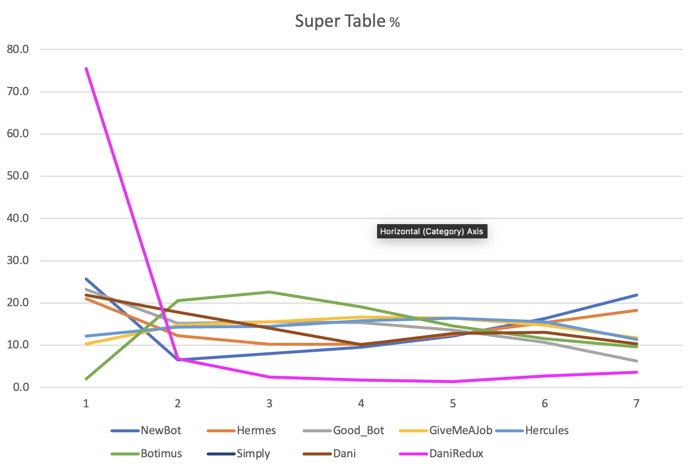

# SpicyOverlord's upgraded Poker Bot Battle
This is an upgraded version of the ITU Poker Bot Battle scripts with extended statistical logging.\
This also contains my own bots and their play statistics and analysis.
## Strength rankings
1. DaniRedux
2. Dani
1. NewBot
1. Hermes
1. good_bot
1. GiveMeAJob
1. Hercules
1. BOTIMUS PRIME
1. Nissemand (previous winner 2023)
1. Simple

### Improvements & thoughts
- call functionality from good_bot
- get hand eval in %
- risk function
- maybe use static variabled?
- calc values in multiples of big_blind
- read the game logs

- look in the external bots folder
- translate some of the bots that look good for testing

- -0.4 * hand_percentage + 14 = max bb amount for call

### Possible bot names
- Hercules
- Kevin
- Unfair Advantage
- Hellmuth
- Negreanu's Dream
- Negreanu's Nightmare
- Statistics Always Wins
- LookingForJobOpportunities

# Stats

### Stat value explanations
- W = Win %
- T3 = Top 3 %
- AP = Average placement
- TF = A score describing the *Fold count* to *Top 3 %* ratio. Basicly how few fold that where used to get into the top 3 (higher is better).
- F = Average folds per game
- after the "-" is placement % for each possible placement (fx: 1st to 10th)

## DaniRedux
> Super Table:\
> W:75.54  T3:84.82  AP:1.978  TF:88.893  F:95.418 - 75.5 6.8 2.5 1.8 1.4 2.7 3.6 5.7\
> High Table:\
> W:68.55  T3:80.35  AP:2.252  TF:79.959  F:100.489 - 68.5 8.2 3.6 2.4 3.5 4.2 4.0 2.5 1.8 1.3\
> Mid Table:\
> W:67.57  T3:84.96  AP:1.915  TF:91.079  F:93.281 - 67.6 10.9 6.5 4.2 4.0 3.5 2.2 1.0 0.2 0.0\
> Low Table:\
> W:27.73  T3:99.59  AP:1.836  TF:219.237  F:45.426 - 27.7 61.4 10.5 0.4 0.0 0.0 0.0 0.0 0.0 0.0

## Dani
> Super Table:\
> W:21.88  T3:53.66  AP:3.548  TF:64.744  AF:82.881 - 21.9 17.8 14.0 10.1 12.8 13.1 10.3\
> High Table:\
> W:39.3  T3:66.1  AP:3.054  TF:66.03  AF:100.106 - 39.3 15.9 10.9 7.8 7.9 6.9 5.2 2.7 2.0 1.3\
> Mid Table:\
> W:46.5  T3:89.68  AP:1.952  TF:122.382  AF:73.279 - 46.5 27.5 15.7 6.5 2.5 1.0 0.3 0.0 0.0 0.0\
> Low Table:\
> W:27.74  T3:99.68  AP:1.8  TF:209.361  AF:47.612 - 27.7 64.8 7.1 0.3 0.0 0.0 0.0 0.0 0.0 0.0

## NewBot
> Super Table:\
> W:25.71  T3:40.14  AP:4.124  TF:78.574  AF:51.085 - 25.7 6.5 8.0 9.5 12.2 16.3 21.9\
> High Table:\
> W:31.52  T3:46.93  AP:4.088  TF:106.359  AF:44.124 - 31.5 7.0 8.4 9.6 9.4 9.8 9.8 7.6 4.1 2.7\
> Mid Table:\
> W:43.14  T3:56.75  AP:3.329  TF:169.33  AF:33.514 - 43.1 4.2 9.4 11.2 10.7 8.4 5.3 3.3 2.0 2.2\
> Low Table:\
> W:35.69  T3:62.2  AP:3.177  TF:210.112  AF:29.603 - 35.7 11.9 14.6 12.5 9.7 6.0 3.2 2.3 2.1 2.0

## Hermes
> Super Table:\
> W:21.0  T3:43.54  AP:4.004  TF:60.353  AF:72.142 - 21.0 12.3 10.2 10.2 12.5 15.4 18.3\
> High Table:\
> W:31.22  T3:45.94  AP:4.43  TF:66.099  AF:69.502 - 31.2 9.0 5.7 5.7 8.7 8.5 9.0 8.7 7.9 5.6\
> Mid Table:\
> W:41.04  T3:61.14  AP:3.214  TF:125.79  AF:48.605 - 41.0 8.8 11.3 10.0 9.4 7.6 4.8 3.0 2.0 2.1\
> Low Table:\
> W:35.48  T3:79.74  AP:2.576  TF:311.285  AF:25.616 - 35.5 27.8 16.4 8.2 3.7 2.1 1.7 1.4 1.5 1.6

## good_bot
> Super Table:\
> W:23.22  T3:53.98  AP:3.384  TF:57.866  AF:93.285 - 23.2 15.2 15.5 15.4 13.6 10.7 6.3\
> High Table:\
> W:22.68  T3:56.28  AP:3.646  TF:76.656  AF:73.419 - 22.7 17.7 15.9 12.5 9.4 6.9 5.9 4.2 2.6 2.2\
> Mid Table:\
> W:36.39  T3:64.2  AP:3.09  TF:92.19  AF:69.639 - 36.4 13.6 14.2 12.8 8.6 5.0 3.2 1.9 2.2 2.2\
> Low Table:\
> W:26.54  T3:84.56  AP:2.516  TF:190.282  AF:44.439 - 26.5 45.3 12.7 4.7 3.0 1.5 1.4 1.3 1.8 1.7

## GiveMeAJob
> Super Table:\
> NOT RUN\
> High Table:\
> W:9.96  T3:44.48  AP:4.245  TF:47.071  AF:94.495 - 10.0 18.5 16.0 14.0 13.0 10.3 6.6 6.0 3.5 2.1\
> Mid Table:\
> W:25.88  T3:75.36  AP:2.78  TF:96.949  AF:77.732 - 25.9 31.0 18.4 9.0 5.9 4.5 2.4 1.2 0.6 1.1\
> Low Table:\
> W:25.72  T3:87.66  AP:2.332  TF:193.728  AF:45.249 - 25.7 50.0 12.0 4.4 2.7 1.8 1.1 0.5 0.8 1.1

## Hercules
> Super Table:\
> W:12.15  T3:40.93  AP:4.02  TF:52.508  AF:77.949 - 12.2 14.3 14.5 15.8 16.4 15.5 11.4\
> High Table:\
> W:23.12  T3:57.42  AP:3.567  TF:73.07  AF:78.582 - 23.1 18.3 16.0 12.0 9.2 7.3 6.4 4.3 2.2 1.3\
> Mid Table:\
> W:38.8  T3:69.08  AP:2.779  TF:98.65  AF:70.026 - 38.8 17.2 13.1 11.9 8.3 5.0 2.4 1.3 0.9 1.1\
> Low Table:\
> W:26.18  T3:76.42  AP:2.715  TF:128.261  AF:59.582 - 26.2 31.5 18.8 9.7 6.2 2.9 2.1 0.9 1.1 0.7

## simply
> Super Table:\
> NOT RUN\
> High Table:\
> W:27.14  T3:42.14  AP:4.351  TF:83.635  AF:50.385 - 27.1 8.0 7.0 9.3 11.4 11.7 8.6 8.0 5.8 2.9\
> Mid Table:\
> W:41.74  T3:67.52  AP:2.874  TF:200.123  AF:33.739 - 41.7 13.0 12.8 10.3 8.5 6.0 3.3 1.9 1.3 1.1\
> Low Table:\
> W:32.98  T3:85.12  AP:2.373  TF:310.521  AF:27.412 - 33.0 37.7 14.5 5.7 3.0 1.7 1.2 1.2 0.9 1.1

## Unfair Advantage
> Super Table:\
> NOT RUN\
> High Table:\
> W:26.9  T3:43.08  AP:4.235  TF:82.077  AF:52.487 - 26.9 8.2 8.0 10.3 12.6 10.7 8.9 6.7 5.1 2.6\
> Mid Table:\
> W:41.9  T3:69.56  AP:2.811  TF:188.521  AF:36.898 - 41.9 13.9 13.8 9.6 8.2 5.4 3.3 1.5 1.2 1.2\
> Low Table:\
> W:34.04  T3:70.98  AP:2.827  TF:206.066  AF:34.445 - 34.0 19.5 17.4 11.5 7.6 3.7 2.3 1.5 1.1 1.3

## BOTIMUS PRIME
> Super Table:\
> W:1.96  T3:45.1  AP:3.97  TF:48.581  AF:92.835 - 2.0 20.6 22.6 19.1 14.6 11.6 9.6\
> High Table:\
> W:12.933  T:49.1  AP:4.085 TF:50.585 AF:97.064 - 12.9 22.5 13.6 11.8 10.6 9.4 7.6 5.9 3.4 2.2\
> Mid Table:\
> W:17.033  T:48.833  AP:3.944 TF:59.559 AF:81.992 - 17.0 19.6 12.2 13.1 11.8 9.5 7.6 4.3 2.8 2.0\
> Low Table:\
> W:23.967  T:66.8  AP:3.095 TF:99.922 AF:66.852 - 24.0 27.5 15.3 11.5 9.5  4.6 2.5 1.8 1.6 1.7

## Nissemand (previous winner 2023)
> Super Table:\
> W:0.26  T3:1.18  AP:6.691  TF:31.204  AF:3.782 - 0.3 0.4 0.5 1.4 3.9 13.4 80.2\
> High Table:\
> W:1.58  T3:2.6  AP:8.445  TF:52.97  AF:4.908 - 1.6 0.4 0.6 1.4 2.7 5.7 9.9 16.4 26.6 34.7\
> Mid Table:\
> W:10.0  T3:20.24  AP:6.115  TF:312.018  AF:6.487 - 10.0 4.3 6.0 7.4 9.0 13.4 13.6 13.4 12.1 10.9\
> Low Table:\
> W:13.0  T3:31.46  AP:5.241  TF:793.523  AF:3.965 - 13.0 8.6 9.8 12.0 10.8 9.9 9.3 8.9 9.8 7.9

## simple
> Super Table:\
> W:0.0  T3:25.23  AP:4.136  TF:22.123  AF:114.045 - 0.0 2.8 22.4 41.5 26.2 5.8 1.3\
> High Table:\
> W:0.23  T3:73.1  AP:3.03  TF:65.688  AF:111.284 - 0.2 27.8 45.1 23.0 3.5 0.4 0.0 0.0 0.0 0.0\
> Mid Table:\
> W:4.44  T3:94.74  AP:2.396  TF:87.626  AF:108.118 - 4.4 58.0 32.3 4.2 0.8 0.2 0.1 0.0 0.0 0.0\
> Low Table:\
> W:9.91  T3:98.07  AP:2.217  TF:108.157  AF:90.674 - 9.9 60.6 27.5 1.7 0.2 0.0 0.0 0.0 0.0 0.0

